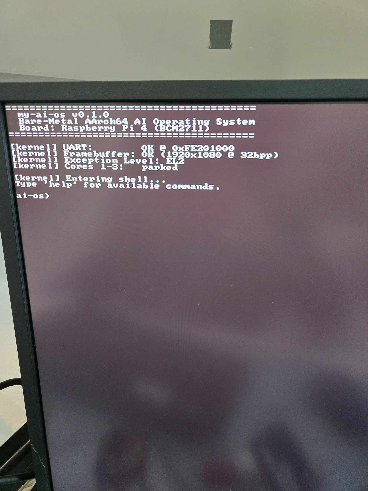

# my-ai-os

A bare-metal AI Operating System for AArch64, written in Rust.

Runs directly on **Raspberry Pi 4** hardware with no Linux, no macOS, nothing underneath.

**v0.2.0** — EMMC2 SD card driver + FAT32 filesystem parser added. Shell now supports `ls`, `cat`, and `sdinfo`.



## What it does

- Boots from SD card on Raspberry Pi 4 (BCM2711)
- Runs at **EL2 (hypervisor privilege level)** — closer to hardware than a normal OS
- Parks CPU cores 1-3, runs on core 0
- Initialises the PL011 UART at `0xFE201000`
- Initialises the HDMI framebuffer via GPU mailbox (1920×1080 @ 32bpp)
- Renders a bitmap font text console on HDMI
- Provides an interactive shell over both HDMI and UART

```
========================================
  my-ai-os v0.2.0
  Bare-Metal AArch64 AI Operating System
  Board: Raspberry Pi 4 (BCM2711)
========================================

[kernel] UART:        OK @ 0xFE201000
[kernel] Framebuffer: OK (1920x1080 @ 32bpp)
[kernel] Exception Level: EL2
[kernel] Cores 1-3:   parked

[kernel] Entering shell...
Type 'help' for available commands.

ai-os> _
```

## Architecture

```
┌─────────────────────────────────────┐
│  Shell (main.rs)                    │  ← interactive command loop
├─────────────────────────────────────┤
│  FAT32 Parser      (fat32.rs)       │  ← MBR→BPB→directory→file read
│  EMMC2 SD Driver   (emmc.rs)        │  ← BCM2711 SD @ 0xFE340000
│  HDMI Text Console (framebuffer.rs) │  ← bitmap font renderer
│  UART Driver       (uart.rs)        │  ← PL011 MMIO driver
│  GPIO Driver       (gpio.rs)        │  ← activity LED control
│  GPU Mailbox       (mailbox.rs)     │  ← property channel IPC
├─────────────────────────────────────┤
│  Boot / EL2 Setup  (boot.rs)        │  ← assembly entry point
│  Linker Script     (linker.ld)      │  ← memory layout @ 0x80000
└─────────────────────────────────────┘
         Raspberry Pi 4 BCM2711
```

## Build

### Prerequisites

```bash
# Install Rust (if not already installed)
curl --proto '=https' --tlsv1.2 -sSf https://sh.rustup.rs | sh

# Add AArch64 bare-metal target
rustup target add aarch64-unknown-none-softfloat

# Install binary tools
cargo install cargo-binutils
rustup component add llvm-tools-preview

# Install QEMU (for emulation)
sudo apt install qemu-system-aarch64   # Linux
brew install qemu                       # macOS
```

### Build for Raspberry Pi 4 (real hardware)

```bash
cargo build --release --no-default-features --features bsp_rpi4
rust-objcopy --strip-all -O binary \
  target/aarch64-unknown-none-softfloat/release/kernel \
  kernel8.img
```

### Build for QEMU (Pi 3 emulation)

```bash
cargo build --release
rust-objcopy --strip-all -O binary \
  target/aarch64-unknown-none-softfloat/release/kernel \
  kernel8.img
qemu-system-aarch64 -M raspi3b -serial stdio -display none -kernel kernel8.img
```

Or simply:

```bash
make qemu       # run in QEMU
make rpi4       # build Pi 4 kernel8.img
```

## Flash to SD Card

1. Format SD card as **FAT32**
2. Copy all files from `sdcard/` to the root of the SD card:
   - `kernel8.img` — your kernel
   - `config.txt` — boot configuration
   - `start4.elf` — GPU firmware
   - `fixup4.dat` — GPU memory split
   - `bcm2711-rpi-4-b.dtb` — device tree
3. Eject safely and insert into Pi 4
4. Power on — output appears on HDMI monitor

## Shell Commands

| Command | Description |
|---------|-------------|
| `help` | Show available commands |
| `info` | Show system information |
| `echo <text>` | Echo text back |
| `clear` | Clear the HDMI screen |
| `blink <n>` | Blink the green activity LED n times |
| `sdinfo` | Show SD card and FAT32 status |
| `ls` | List files in the SD card root directory |
| `cat <FILE.EXT>` | Print file contents (8.3 format, e.g. `README.TXT`) |
| `halt` | Halt the CPU |

## Roadmap

- [x] Boot on bare metal (EL2)
- [x] UART driver (PL011)
- [x] HDMI framebuffer (GPU mailbox)
- [x] Bitmap font text console
- [x] Interactive shell
- [x] EMMC2 SD card driver (BCM2711 @ 0xFE340000)
- [x] FAT32 filesystem parser (MBR, BPB, FAT chain, directory, file read)
- [x] Shell commands: `ls`, `cat`, `sdinfo`
- [ ] Port `llama2.c` to `no_std` Rust (`llm.rs`)
- [ ] `ask <prompt>` command — LLM inference at EL2
- [ ] System timer + interrupts
- [ ] Preemptive scheduler
- [ ] Virtual memory (MMU + page tables)
- [ ] Exception vector table
- [ ] NPU driver (Intel Lunar Lake — future hardware)

## Hardware

- **Primary target:** Raspberry Pi 4 Model B (BCM2711, Cortex-A72)
- **Emulation:** QEMU `raspi3b` machine (Pi 3 compatible)
- **Serial debug:** CP2102 USB-to-UART adapter on GPIO 14/15 at 115200 baud

## License

MIT
